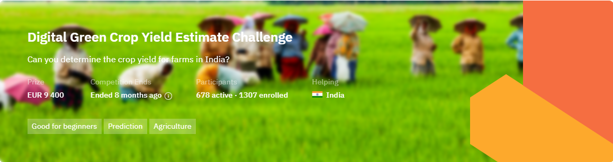

# Description

Smallholder farmers are crucial contributors to global food production, and in India often suffer most from poverty and malnutrition. These farmers face challenges such as limited access to modern agriculture, unpredictable weather, and resource constraints. To tackle this issue, Digital Green collected data via surveys, offering insights into farming practices, environmental conditions, and crop yields.

The objective of this challenge is to create a machine learning solution to predict the crop yield per acre of rice or wheat crops in India. Our goal is to empower these farmers and break the cycle of poverty and malnutrition.

A crop yield model could revolutionise Indian agriculture, and serve as a global model for smallholder farmers. Accurate yield predictions empower smallholder farmers to make informed planting and resource allocation decisions, reducing poverty and malnutrition and improving food security. As climate change intensifies, adaptive farming practices become crucial, making precise yield predictions even more valuable. Solutions developed here can drive sustainable agriculture and ensure a stable food supply for the world's growing population. This challenge offers data scientists and machine learning enthusiasts a unique chance to make a real difference in vulnerable populations' lives while advancing global food security in a concise, impactful way.

About Digital Green (<a href="https://www.digitalgreen.org/" target="_blank" rel="noreferrer noopener">digitalgreen.org</a>)

 

Digital Green is a global development organization that empowers smallholder farmers to lift themselves out of poverty by harnessing the collective power of technology and grassroots-level partnerships.

About Fair Forward AI (<a href="https://www.bmz-digital.global/en/overview-of-initiatives/fair-forward/" target="_blank" rel="noreferrer noopener">bmz-digital.global/en/overview-of-initiatives/fair-forward</a>)

 

The Deutsche Gesellschaft für Internationale Zusammenarbeit (GIZ), on behalf of the German Federal Ministry for Economic Cooperation and Development (BMZ), supports this challenge and the Digital Green grant in India:

The “FAIR Forward – Artificial Intelligence for all” initiative, which promotes a more open, inclusive, and sustainable approach to AI on an international level. FAIR Forward seeks to improve the foundations for AI innovation and policy in seven partner countries: Rwanda, Uganda, Ghana, South Africa, Kenya, Indonesia, and India. Together with their partners, they focus on three areas of action: (1) strengthen local technical know-how on AI, (2) increase access to open AI training data, (3) develop policy frameworks ready for AI. For more information, <a href="https://www.bmz-digital.global/en/overview-of-initiatives/fair-forward/" target="_blank" rel="noreferrer noopener">see</a>.

# Evaluation

The evaluation metric for this competition is <a href="https://zindi.africa/learn/zindi-error-metric-series-what-is-root-mean-square-error-rmse#:~:text=Root%20Mean%20Squared%20Error%20or,want%20the%20model%20to%20achieve." target="_blank" rel="noreferrer noopener">Root Mean Squared Error</a>.

For every row in the dataset, submission files should contain 2 columns: ID and Target.

Your submission file should look like this (numbers to show format only):

<pre>ID	        Yield</pre>
<pre>ID_F9XXEXN2ADR2	  437.9</pre>
<pre>ID_SO3VW2X4QO93	  100.56 </pre>

